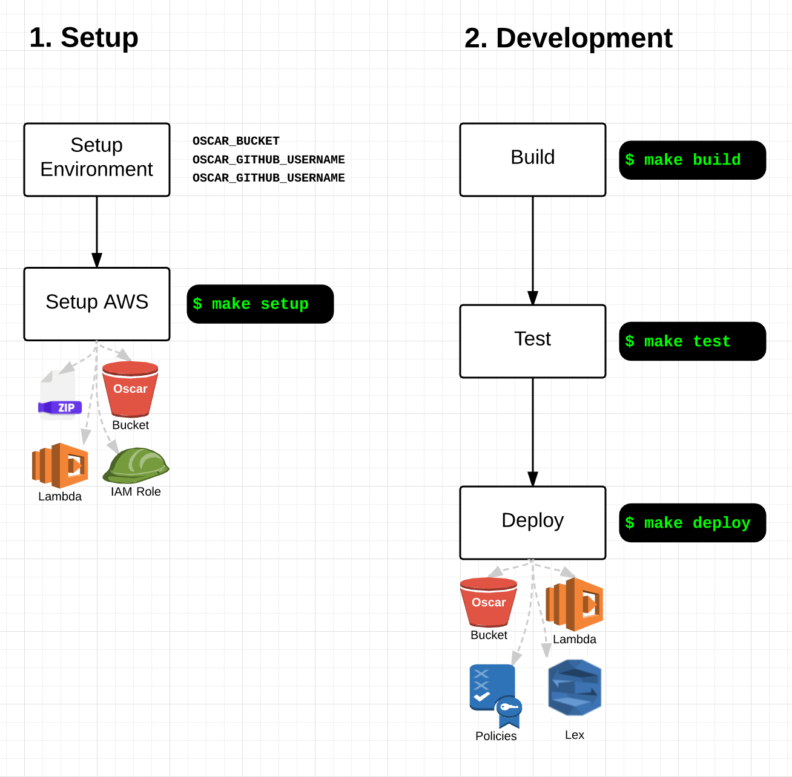

# Lex Starter Kit
TODO Circle TODO CodeCode

> Build a chatbot with AWS Lex and Lambda in minutes!

This project is a template quickly creating chatbox using AWS Lex and Lambda.

It is based on [lex-oscarbot](https://github.com/mindmelting/lex-oscarbot), a chatbot built for the [AWS Chatbot Challenge] by [dwmkerr]() and [mindmelting]().

- [Quick Start](#quick-start)
- [Developer Guide](#developer-guide)
	- [Environment Setup](#environment-setup)
	- [Useful Commands](#useful-commands)
	- [Circle CI](#circle-ci)
	- [Useful Reading](#useful-reading)

# Quick Start

Have a bot up and running in seconds with:

```bash
aws login
export BUCKET=<someuniquename>
make build
make deploy
```

Your bot is now running on AWS!

# Developer Guide

The project structure is:

```
├── artifacts     # generated files/resources, not checked in
├── aws           # some aws resources used in setup
├── docs          # documentation/diagrams etc
├── lambda        # lambda function and tests
├── lex           # slots and intent json files
└── scripts       # scripts used by the makefile
```

This diagram shows the key steps for setup and development:



## Environment Setup

Install:

- [The AWS CLI](https://aws.amazon.com/cli/)
- [jq](https://stedolan.github.io/jq/download/)

Ensure you are logged into the AWS CLI as a user with permissions to create Lambda Functions, Buckets, Roles, Policies and Lex Models.

Set the following environment variables:

| Variable | Usage |
|----------|-------|
| `DEBUG=lambda` | Optional. Enables debug output (we use the [debug](https://www.npmjs.com/package/debug) module. |
| `TWILIO_SID` | A Twilio account id for sending text messages. |
| `TWILIO_AUTH_TOKEN` | A Twilio auth token for sending text messages. |
| `TWILIO_PHONE_NUMBER` | A Twilio phone number to send messages from. |

You can now call:

```bash
make setup
```

Which will build the lambda function, bucket and policies.

## Deploying Changes

If you change the lambda function, slots, intents or bot, just call:

```bash
make deploy
```

This will rebuild the lambda function and redeploy it. It will also rebuild and publish all slots, intents and bots.

## Useful Commands

Here are some commands you can run to help work with the project:

| Command | Usage |
|---------|-------|
| `make lint` | Lints the code. |
| `make test` | Runs the unit tests. |
| `make setup` | Sets up your AWS resources. First time setup only. |
| `make build` | Builds the lamba function and zips it up locally. |
| `make deploy` | Deploys the code, slots and intents. |
| `make utterances` | Helper to print out all supported utterances. Useful when building docs. |
| `npm run test:debug` | Runs tests with the Chrome Inspector. |
| `npm run coverage` | Runs tests, generating a coverage report. |

## Circle CI

`circle.yml` will build changes on master and deploy to AWS (make sure you have set the Circle AWS key in the console).

## Useful Reading

- https://docs.aws.amazon.com/lex/latest/dg/slack-bot-association.html
