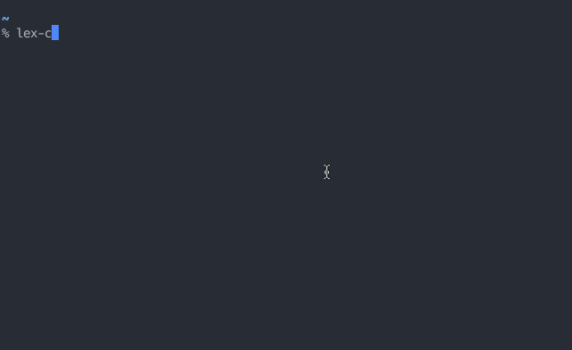
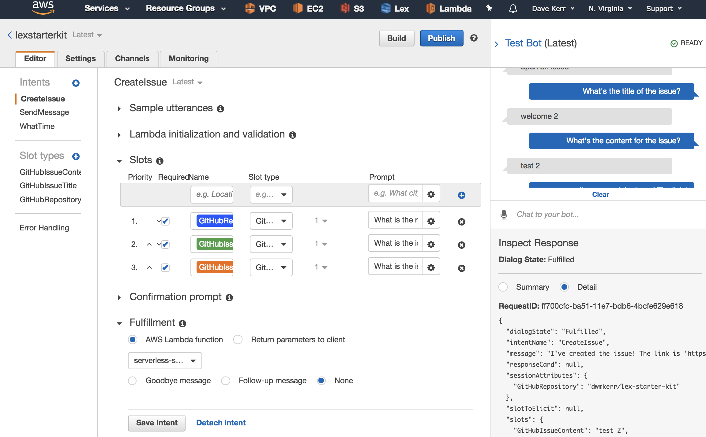

# Lex Starter Kit [](https://circleci.com/gh/dwmkerr/lex-starter-kit) [](https://codecov.io/gh/dwmkerr/lex-starter-kit)

> Build a chatbot with AWS Lex and Lambda in minutes!

This project is a template quickly creating chatbox using AWS Lex and Lambda.

It is based on [lex-oscarbot](https://github.com/mindmelting/lex-oscarbot), a chatbot built for the [AWS Chatbot Challenge](https://aws.amazon.com/events/chatbot-challenge/) by [dwmkerr](https://github.com/dwmkerr), [mindmelting](https://github.com/mindmelting) and Selin Lanzafame.

- [Quick Start](#quick-start)
- [Developer Guide](#developer-guide)
	- [Environment Setup](#environment-setup)
	- [Useful Commands](#useful-commands)
	- [Circle CI](#circle-ci)
	- [Useful Reading](#useful-reading)

# Quick Start

Have a bot up and running in seconds with:

```bash
aws configure
make setup
make deploy
```

Your bot is now running on AWS! You can use the [lex-chat](https://github.com/dwmkerr/lex-chat) tool to chat with the bot:

```bash
npm install -g lex-chat
```



You can see your bot in the [Lex Console](https://console.aws.amazon.com/lex/home):



# Developer Guide

The project structure is:

```
├── artifacts     # generated files/resources, not checked in
├── aws           # some aws resources used in setup
├── docs          # documentation/diagrams etc
├── lambda        # lambda function and tests
├── lex           # slots and intent json files
└── scripts       # scripts used by the makefile
``` 

A full conference presentation goes through this project (a video link will be available shortly). For those who want to follow along with the presentation, you can check out the code at different points using these links:

| Branch | Section |
|--------|---------|
| [`demo1`](https://github.com/dwmkerr/lex-starter-kit/tree/demo1) | Demo 1: The basics and your first intent. |
| [`demo2`](https://github.com/dwmkerr/lex-starter-kit/tree/demo2) | Demo 2: Adding slots. |
| [`demo3`](https://github.com/dwmkerr/lex-starter-kit/tree/demo3) | Demo 3: Conversation state with sessions. |

## Environment Setup

Install:

- [The AWS CLI](https://aws.amazon.com/cli/)
- [jq](https://stedolan.github.io/jq/download/)

Ensure you are logged into the AWS CLI as a user with permissions to create Lambda Functions, Buckets, Roles, Policies and Lex Models.

Set the following environment variables:

| Variable | Usage |
|----------|-------|
| `TWILIO_SID` | A Twilio account id for sending text messages. |
| `TWILIO_AUTH_TOKEN` | A Twilio auth token for sending text messages. |
| `TWILIO_PHONE_NUMBER` | A Twilio phone number to send messages from. |

If you change config, don't forget to run:

```bash
make config
```

Which will build the lambda function, bucket and policies.

## Deploying Changes

If you change the lambda function, slots, intents or bot, just call:

```bash
make deploy

# or just deploy the code
make deploy-lambda

# or just deploy the lex models
make deploy-lex
```

## Useful Commands

Here are some commands you can run to help work with the project:

| Command | Usage |
|---------|-------|
| `make lint` | Lints the code. |
| `make test` | Runs the unit tests. |
| `make setup` | Sets up your AWS resources. First time setup only. |
| `make config` | Sets up the config for the lambda function. Only needed if config changes. |
| `make build` | Builds the lamba function and zips it up locally. |
| `make deploy` | Deploys the code, slots and intents. |
| `make utterances` | Helper to print out all supported utterances. Useful when building docs. |

If you are working on the code (in the [`./lambda/`](./lambda) folder, you can also use the commands below:

| Command | Usage |
|---------|-------|
| `npm test` | Test the code. |
| `npm run test:debug` | Test the code, using the debugger. |
| `npm run coverage` | Test the code, checking coverage. |
| `npm run lint` | Lint the code. |

## Circle CI

`circle.yml` will build changes on master and deploy to AWS (make sure you have set the Circle AWS key in the console).

## Useful Reading

- [Lambda and Lex - Input and Response Format](http://docs.aws.amazon.com/lex/latest/dg/lambda-input-response-format.html)
- https://docs.aws.amazon.com/lex/latest/dg/slack-bot-association.html
